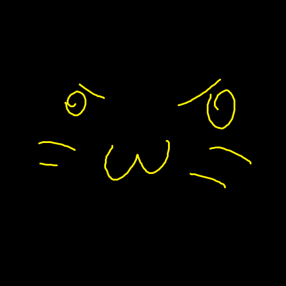

# Лабы по РПиРП на C++

## Я люблю писать код на С++

Я переделываю структуру проекта уже третий раз, просто потому что оно то не компилится, то мне не нравится просто

Но сча я решил, что хватит и сделал норм по моему мнению

Интересного тут нет ничего, я просто учусь писать правильно на C++ 
(кому не впадлу, можете даже посмотреть предыдущие версии в коммитах, там приколы)

Спасибо чатгпт, что рассказал про стуктуру и всякие мелочи, типо const ссылок на которые я положил _огроооомный_ болт.

